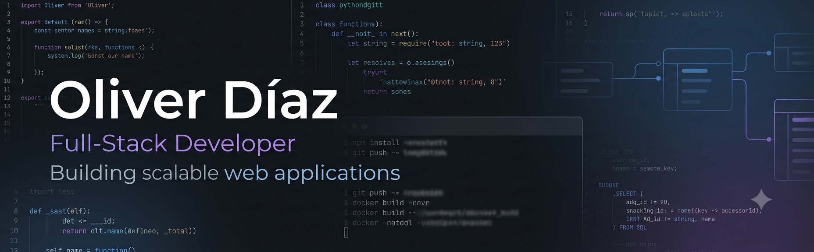

# Hi, I'm Oliver Díaz 👋

## Full-Stack Developer

I'm a software developer passionate about building scalable and maintainable web applications.

Currently focused on backend development, software architecture, testing, and modern web technologies.

---

## 🧑‍💻 About Me

I'm a dedicated software engineer with a strong focus on backend development and clean architecture. I enjoy solving complex problems and building efficient, scalable solutions. Always learning and staying up-to-date with modern technologies and best practices.

## 🚀 Technologies & Tools

## 📚 Currently Learning

- Backend Architecture
- Testing with Jest
- DevOps
- Cloud Computing
- Docker

## 💻 Featured Projects

### 🛒 Hipermercado Superior
E-commerce platform focused on modern frontend architecture and scalable backend design.

**Stack:** Angular • Node.js • Express • Databases

[View Project](https://github.com/oliverdiaz873/hipermercado-superior)

### 🔐 Backend API
RESTful API with authentication and authorization, following clean architecture principles.

**Stack:** Node.js • Express • PostgreSQL • JWT

[View Project](https://github.com/oliverdiaz873/backend-api)

### 📚 Other Projects
Additional projects showcasing various skills and technologies.

[View Projects](https://github.com/oliverdiaz873?tab=repositories)

---

## 📈 GitHub Stats

---

## 📈 My Goals

- Build production-ready applications
- Improve software engineering practices
- Contribute to open source projects
- Grow as a backend and full-stack developer

---

## 📫 Connect with me

[GitHub](https://github.com/oliverdiaz873)
